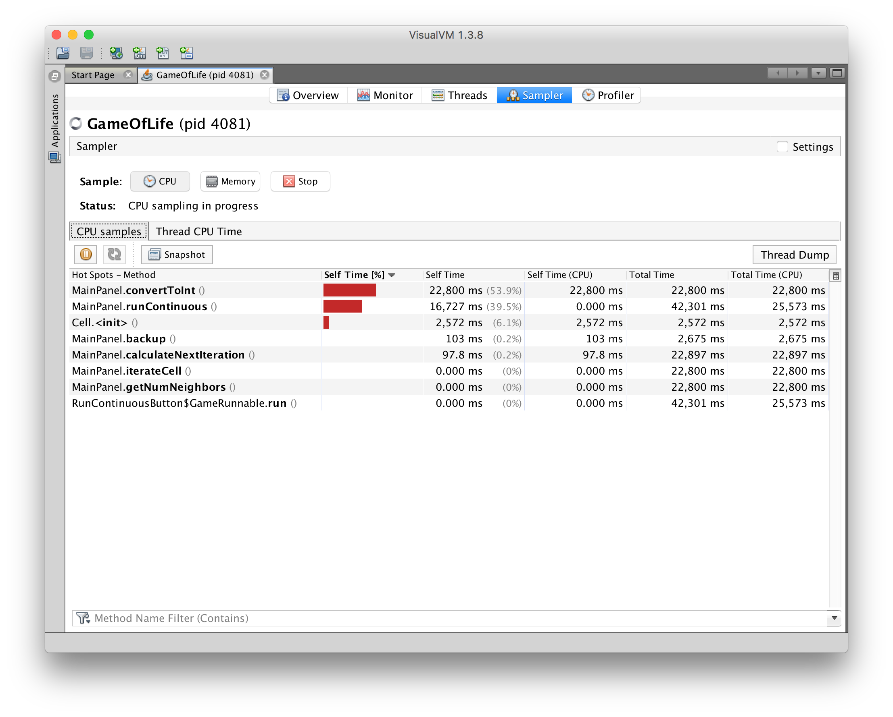
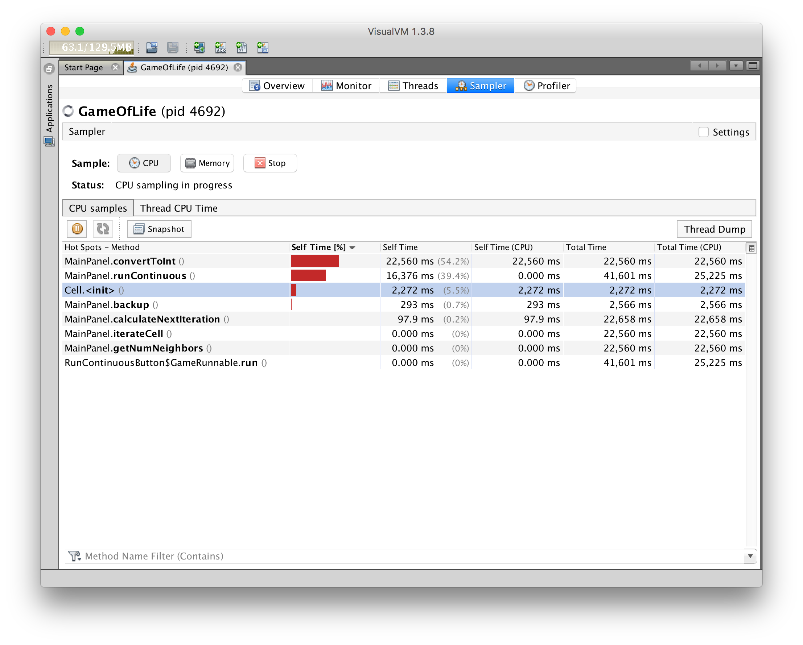
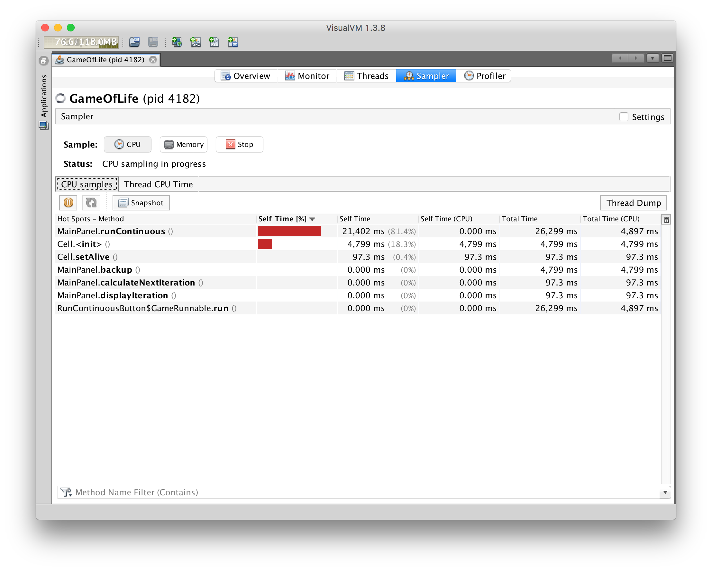
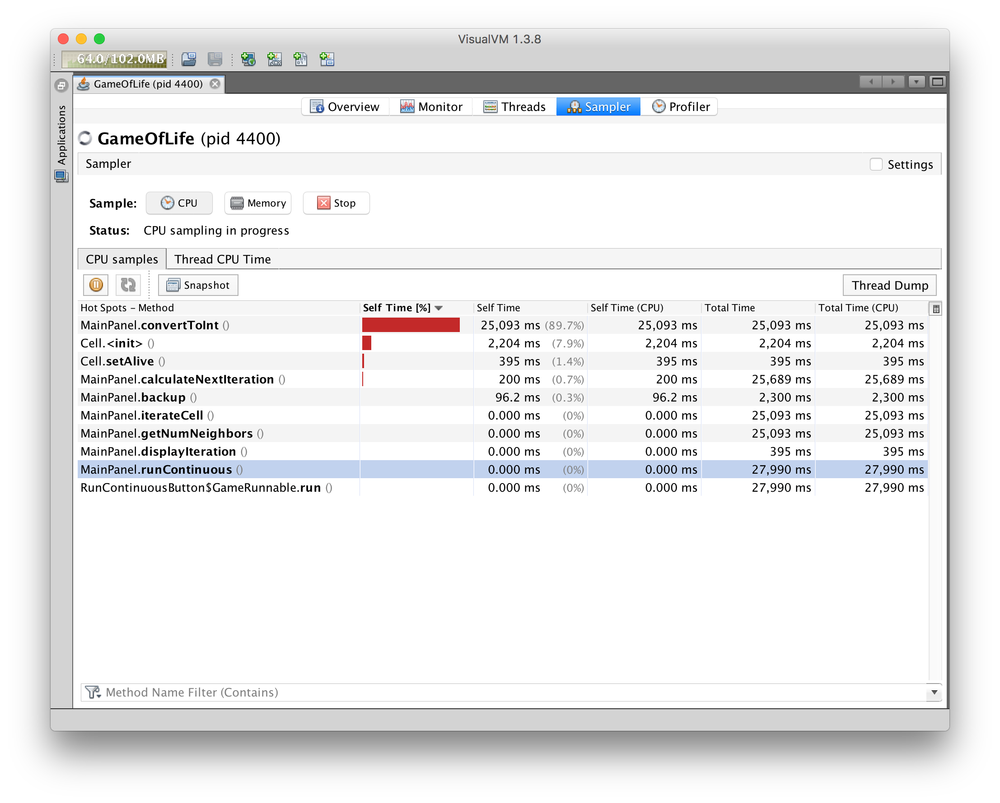

# SlowLifeGUI

Conway's Game of Life, in GUI Form. Deliberately non-performant.

#### Performance Analysis

Profiler such as VisualVM used in this deliverable makes it easy to
locate resource-consuming methods in the program. For this specific
program, there are at least three performances issues caused by useless
iterations.

The original profile:

   

1. Meaningless string in `Cell.java`, refactored: `toString()`
    - Solution: remove the string building operation, and the CPU consuming decrease correspondingly.
        
        

2. Useless int converter in `MainPanel.java`, refactored: `convertToInt(int x)`
    - Solution: remove the building operation, and the CPU consuming decrease correspondingly.
        
        

3. Meaningless assigning iteration in `MainPanel.java`, refactored: `runContinuous()`
    - Solution: remove the assigning iteration, and the CPU consuming decrease correspondingly.
        
        
